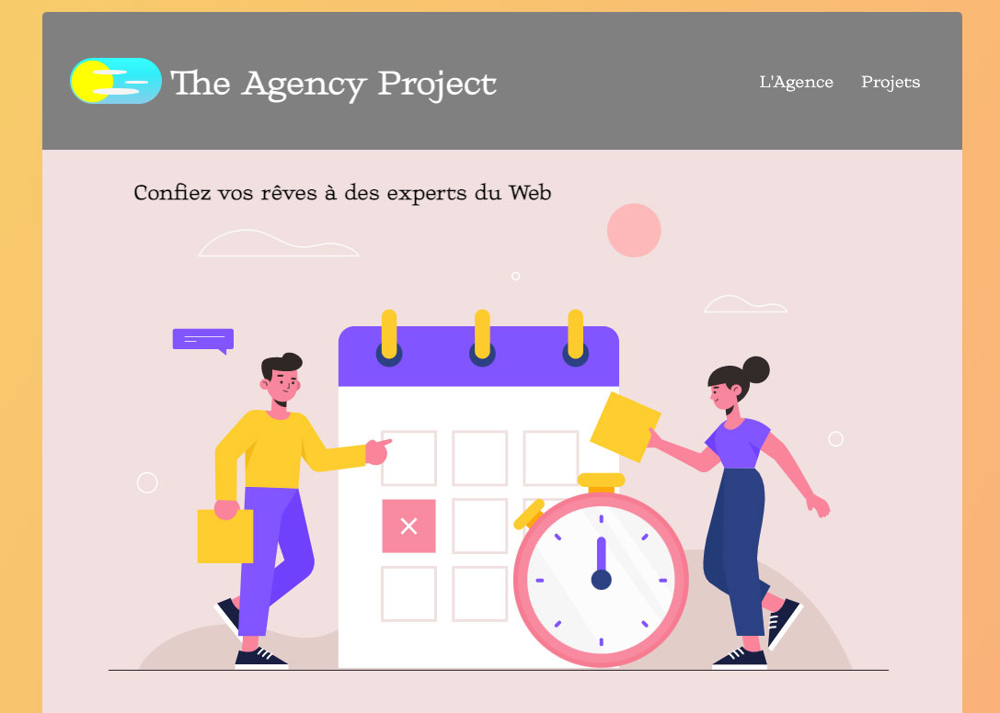

# The Agency Project

Dummy web agency website coded with React.
Developped in two days for THP Next bootcamp 2021

  

## Tech

Javascript and [React](https://github.com/facebook/react), [Node Sass](https://github.com/sass/node-sass).

## Potential Improvements

- useMediaQuery to automatically select Day or Night mode
- Animations (Motion API)

## Contributors

- [:cactus: Hugo Péran Séjourné](https://github.com/HugoPeranSejourne)
- [:deciduous_tree: Dan Bertrand](https://github.com/DanBertrand)
- [:seedling: Mathieu Joly](https://github.com/mathieu-superpose)
